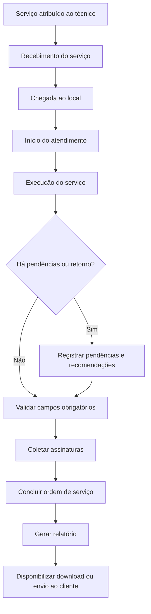

# Report Manager

## 1. Visão geral

O **Report Manager** é uma plataforma web para gestão de serviços técnicos em campo e geração de relatórios em PDF.

O contexto inicial é o de empresas e profissionais de refrigeração industrial que realizam manutenções, instalações, inspeções, montagens, desmontagens, comissionamentos e outros serviços técnicos em clientes.

Durante o atendimento, o técnico registra informações do serviço, fotos, medições, peças utilizadas, diagnósticos, recomendações e assinaturas. Ao final, a plataforma gera um relatório padronizado, armazena o histórico e permite download ou envio ao cliente.

## 2. Objetivos do produto

- Padronizar registros feitos em campo;
- Reduzir relatórios manuais;
- Funcionar bem em dispositivos móveis;

Também é possível, se desejável, atingir os seguinte objetivos:

- Centralizar dados operacionais da empresa;
- Preservar histórico de clientes, unidades e equipamentos;
- Melhorar rastreabilidade das atividades;
- Gerar indicadores de operação;

## 3. Perfis de usuário

### Administrador

Responsável por configurar e gerir a plataforma.

Principais responsabilidades:

- Gerenciar usuários e outras entidades(clientes, unidades, contatos...)
- Acompanhar dashboards e auditoria.

### Supervisor

Responsável por acompanhar a operação e revisar os serviços.

Principais responsabilidades:

- Acompanhar serviços em andamento;
- Revisar e aprovar relatórios;

### Técnico

Responsável pela execução dos serviços em campo.

Principais responsabilidades:

- Visualizar serviços atribuídos;
- Iniciar, pausar e concluir atendimentos;
- Registrar diagnósticos, atividades e medições;
- Tirar fotos;
- Adicionar comentários e recomendações;
- Solicitar a geração do relatório.

## 4. Informações principais

A plataforma deve organizar os seguintes grupos de informação:

- **Organização:** dados da empresa prestadora, logotipo, contatos e configurações usadas nos relatórios.
- **Usuários:** dados cadastrais, perfil, permissões, status, registro profissional e assinatura.
- **Clientes:** dados cadastrais, contatos, contratos, observações e unidades vinculadas.
- **Unidades:** endereço, responsável local, horário de funcionamento, instruções de acesso e observações de segurança.
- **Equipamentos:** categoria, fabricante, modelo, número de série, patrimônio, localização, capacidade, dados técnicos, fotos, histórico e status operacional.
- **Peças:** nome, código, fabricante, categoria, unidade de medida, estoque, compatibilidade e observações.
- **Ordens de serviço:** cliente, unidade, equipamentos, tipo de serviço, técnicos, datas, prioridade, solicitação, status, atividades, medições, checklists, peças, fotos, comentários, assinaturas, aprovação e relatórios.
- **Tipos de serviço:** manutenção preventiva, manutenção corretiva, instalação, montagem, desmontagem, inspeção, limpeza, troca de componente, comissionamento e outros.
- **Registros de campo:** atividades executadas, medições técnicas, fotos, comentários, peças utilizadas, diagnósticos e recomendações.

## 5. Fluxo principal do técnico

### Dúvida sobre o fluxo

- Esse fluxo é realista ou falta algo?

### Recebimento do serviço

O técnico visualiza as informações necessárias para o atendimento:

- Cliente;
- Unidade;
- Endereço;
- Contato;
- Horário;
- Problema relatado;
- Equipamentos;
- Instruções.

### Chegada ao local

Ao iniciar o atendimento, a plataforma registra data, hora, usuário responsável e geolocalização.

### Execução

Durante o serviço, o técnico pode:

- Selecionar equipamentos;
- Preencher checklists;
- Registrar diagnóstico;
- Adicionar medições;
- Registrar atividades;
- Adicionar peças;
- Tirar fotos;
- Adicionar comentários;
- Informar recomendações.

Os dados devem ser salvos de forma frequente para reduzir perda de informação.

### Finalização

Antes da conclusão, a plataforma valida campos obrigatórios. O técnico informa resultado, situação do equipamento, pendências, recomendações, necessidade de retorno e horário final.

Em seguida, são coletadas as assinaturas necessárias.

### Geração do relatório

O relatório pode conter:

- Dados da empresa prestadora;
- Número da ordem de serviço;
- Dados do cliente e da unidade;
- Responsável local;
- Técnicos envolvidos;
- Data, horários e duração;
- Geolocalização;
- Equipamentos atendidos;
- Problema relatado;
- Diagnóstico;
- Atividades executadas;
- Checklists;
- Medições;
- Peças utilizadas;
- Fotografias;
- Recomendações;
- Pendências;
- Assinaturas;
- Aprovação;
- Histórico e versão.

- Existem duas versões do mesmo relatório, uma para clientes e outra para uso interno?

## 6. Dashboard administrativo(Não é o foco no primeiro momento)

### Indicadores gerais

- Serviços agendados, em andamento, concluídos e atrasados;
- Tempo médio de atendimento;
- Tempo médio por tipo de serviço;
- Clientes e equipamentos atendidos;
- Retornos;
- Serviços aguardando aprovação;
- Serviços aguardando peças.

### Indicadores por técnico

- Quantidade de atendimentos;
- Tempo médio;
- Taxa de conclusão;
- Serviços atrasados;
- Retornos;
- Horas trabalhadas;
- Peças utilizadas.

### Indicadores por cliente e equipamento

- Quantidade de atendimentos;
- Equipamentos com mais ocorrências;
- Falhas recorrentes;
- Tempo de resolução;
- Peças substituídas;
- Custo acumulado;
- Última e próxima manutenção;
- Situação operacional.

## 7. Requisitos importantes

- A experiência principal do técnico deve ser mobile-first;
- Fotos e PDFs devem ser armazenados com controle de acesso;
- Relatórios devem manter histórico e versão;
- Dados de campo devem ter rastreabilidade;
- O sistema deve diferenciar perfis e permissões.

## 8. MVP recomendado

### Administração

- Login;
- Usuários;
- Perfis e permissões;
- Clientes;
- Unidades;
- Equipamentos;
- Peças;
- Tipos de serviço;
- Ordens de serviço.

### Operação em campo

- Listagem de serviços;
- Início, pausa e finalização;
- Atividades;
- Equipamentos;
- Peças;
- Fotos;
- Comentários;
- Assinaturas.

### Relatórios

- Geração de relatório;
- Versionamento;
- Download;
- Histórico.

## 9. Dúvidas em aberto

### Origem dos dados

- De onde vão vir os dados iniciais?
- Existe uma planilha?
- Existe alguém que cadastra manualmente?

### Funcionamento offline

- O sistema deve funcionar offline?

### Projeto e comercial

- Qual prazo?
- Qual preço?
- Qual forma de pagamento?
